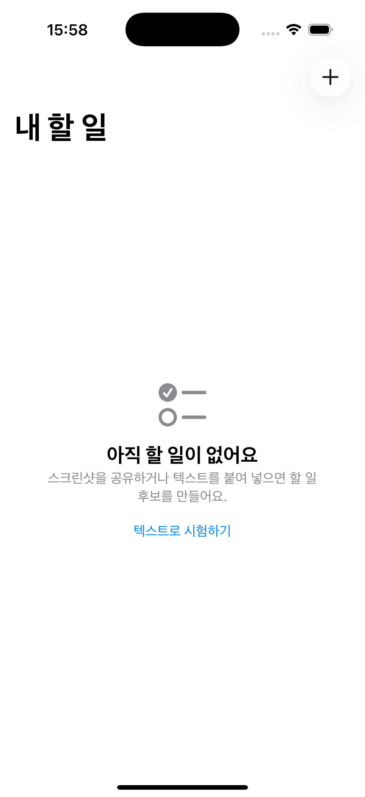

# Whenly 통합 개발 기획서

> 스크린샷 한 장을 검토 가능한 할 일과 캘린더 일정으로 바꾸는 iOS 개인 비서

| 문서 정보 | 값 |
| --- | --- |
| 문서 버전 | 1.0 |
| 기준일 | 2026-08-01 |
| 제품 단계 | R0 기술 골격 완료, 실기기 MVP 준비 |
| 기본 플랫폼 | iOS 17 이상 |
| 저장 원칙 | 앱 할 일이 원본, Apple 캘린더는 선택적 사본 |
| AI 원칙 | AI 결과는 제안이며 사용자가 저장 전에 확인 |
| 구현 방식 | 온디바이스 Vision OCR + 백엔드 경유 OpenAI Responses API |

## 1. 한눈에 보는 결론

Whenly는 사용자가 메시지, 공지, 예약 화면을 캡처한 뒤 iOS 공유 시트에서 앱을 선택하면
로컬 OCR과 문맥 분석으로 할 일 후보를 만들고, 사용자가 확인한 결과를 앱의 할 일 목록과
선택적으로 Apple 캘린더에 저장하는 개인 비서다.

현재 저장소에는 메인 앱, Share Extension, App Group inbox, Vision OCR, OpenAI 백엔드 어댑터,
검토 화면, 로컬 할 일 저장, EventKit 캘린더 저장까지 구현되어 있다. 백엔드 테스트 8개와
iOS 테스트 9개가 통과한 상태다. 다만 실제 서명과 App Group entitlement를 적용한 실기기
공유 흐름, 실제 OpenAI 키를 사용한 종단간 검증, 운영 인증과 요청 제한, 캘린더 수정/삭제
정책은 아직 완료되지 않았다. 따라서 현재 상태는 "작동하는 R0 골격"이며 "운영 출시 완료"가 아니다.

### 1.1 제품 약속

- 캡처를 잃지 않는다.
- AI가 애매하면 확정하지 않는다.
- 캘린더 권한이 없어도 앱 할 일은 저장한다.
- 원본 이미지는 기본적으로 기기 밖으로 보내지 않는다.
- OpenAI API 키는 앱과 Share Extension에 넣지 않는다.
- 자동화보다 사용자의 최종 통제권을 우선한다.

### 1.2 이번 MVP의 성공 정의

1. 사용자가 스크린샷 공유 후 15초 안에 검토 가능한 초안을 본다.
2. 날짜가 명시된 검증 세트에서 날짜 추출 정확도 95% 이상을 달성한다.
3. 제목을 수정하지 않고 저장하는 비율 80% 이상을 달성한다.
4. 캘린더 권한 거절과 AI 실패 상황에서도 캡처와 앱 할 일을 잃지 않는다.
5. API 키, 원본 OCR 텍스트, 원본 이미지가 로그나 저장소에 노출되지 않는다.

## 2. 문제와 기회

### 2.1 해결하려는 문제

일정과 해야 할 일은 캘린더 앱이 아니라 메신저, 커뮤니티 공지, 이메일, 예약 화면에 먼저 나타난다.
사용자는 내용을 기억하거나 다시 입력해야 하며, 제목과 날짜를 옮기는 몇 번의 동작 때문에 등록을
미루거나 잊는다. 기존 OCR 앱은 글자를 복사하는 데 그치고, 캘린더 앱은 구조화된 입력을 요구한다.

### 2.2 핵심 사용자

| 사용자 | 상황 | 원하는 결과 |
| --- | --- | --- |
| 일정이 많은 직장인 | 메신저에서 회의와 제출 요청을 자주 받음 | 빠르게 할 일과 일정을 함께 기록 |
| 학생 | 단체 채팅과 LMS 공지를 캡처함 | 마감일을 놓치지 않고 과제를 목록화 |
| 개인 일정 관리자 | 예약, 행사, 배송, 병원 화면을 저장함 | 다시 입력하지 않고 날짜와 메모 보존 |
| 프라이버시 민감 사용자 | 사적인 대화 캡처를 다룸 | 이미지 외부 전송을 최소화하고 저장 전 검토 |

### 2.3 대표 Jobs-to-be-Done

- "공지 화면을 봤을 때 나중에 다시 읽지 않고 해야 할 일을 만들고 싶다."
- "날짜와 시간이 확실할 때만 캘린더에 추가하고 싶다."
- "AI가 잘못 이해했을 때 제목과 날짜를 직접 고치고 싶다."
- "네트워크나 권한 문제로 실패해도 캡처가 사라지지 않았으면 좋겠다."

## 3. 제품 범위

### 3.1 MVP 포함

- iOS 공유 시트에서 이미지 한 장 수집
- App Group inbox에 이미지와 메타데이터를 원자적으로 보관
- 메인 앱에서 대기 캡처 가져오기
- Apple Vision 기반 온디바이스 OCR
- OCR 텍스트를 백엔드로 보내 OpenAI Responses API 구조화 분석
- 제목, 메모, 날짜/시간, 근거, 모호성, 신뢰도 검토 및 수정
- 앱 내부 할 일 저장, 완료/미완료 전환, 삭제
- 사용자가 선택한 경우 Apple 캘린더 일정 생성
- 로딩, 빈 상태, 오류, 권한 거절, 재시도 상태
- VoiceOver 레이블과 색상 외 상태 표현

### 3.2 MVP 제외

- Android, 웹, macOS 클라이언트
- 캘린더 일정의 양방향 동기화
- 여러 사용자 협업과 계정 동기화
- 이미지 여러 장 동시 분석
- 백그라운드에서 사용자 확인 없이 자동 등록
- 서버에 원본 스크린샷 영구 저장
- 범용 챗봇과 자유 형식 에이전트

### 3.3 이후 후보

- 캡처 여러 장 묶기와 한 캡처에서 여러 할 일 추출
- 반복 일정과 위치 기반 알림
- 검색, 태그, 프로젝트별 분류
- 온디바이스 소형 LLM과 클라우드 모델 선택
- iCloud 동기화와 위젯
- 캘린더 일정 수정/삭제 연결 정책

## 4. 제품 원칙과 안전 규칙

| ID | 규칙 | 제품 동작 |
| --- | --- | --- |
| P-01 | AI 결과는 제안 | 저장 전 검토 화면을 반드시 거침 |
| P-02 | 낮은 신뢰도는 확정 금지 | confidence가 0.80 미만이면 사용자 확인 표시 |
| P-03 | 모호한 날짜는 캘린더 금지 | 날짜가 없거나 ambiguities가 있으면 캘린더 토글 비활성화 |
| P-04 | 앱 할 일이 원본 | 캘린더 저장 실패와 무관하게 앱 할 일을 보존 |
| P-05 | 캡처 유실 금지 | 앱 할 일 저장 성공 전 inbox 항목을 삭제하지 않음 |
| P-06 | 키는 서버에만 | iOS 번들과 Share Extension에 OpenAI 키를 포함하지 않음 |
| P-07 | 이미지 로컬 우선 | Vision OCR을 사용하고 서버에는 기본적으로 OCR 텍스트만 전송 |
| P-08 | Share Extension은 짧게 | 수집과 저장만 수행하고 AI 요청과 EventKit 쓰기를 하지 않음 |
| P-09 | 접근 가능한 상태 | 색상만으로 상태를 전달하지 않고 레이블과 설명을 제공 |
| P-10 | 실패는 복구 가능 | 재시도와 수동 입력 경로를 제공 |

## 5. 핵심 사용자 여정

### 5.1 정상 흐름

1. 사용자가 iPhone에서 일정이나 요청 화면을 캡처한다.
2. 사진 또는 스크린샷 화면에서 공유 버튼을 누르고 Whenly를 선택한다.
3. Share Extension이 이미지와 캡처 ID, 생성 시각을 App Group inbox에 저장한다.
4. 사용자가 메인 앱을 열면 가장 오래된 미처리 캡처를 가져온다.
5. Vision이 기기에서 텍스트를 인식한다.
6. 앱이 OCR 텍스트와 기준 시각, 로케일, 시간대를 백엔드로 전송한다.
7. 백엔드가 OpenAI 구조화 출력으로 TaskDraft를 생성하고 재검증한다.
8. 사용자가 제목, 메모, 날짜, 시간, 근거, 모호성을 확인하고 수정한다.
9. 앱 할 일을 먼저 저장한다.
10. 캘린더 추가가 허용되고 사용자가 선택했으면 EventKit으로 일정을 만든다.
11. 모든 필수 저장이 성공하면 inbox 캡처를 처리 완료로 정리한다.

### 5.2 실패 및 복구 흐름

| 실패 | 사용자에게 보이는 것 | 데이터 처리 | 복구 |
| --- | --- | --- | --- |
| 이미지 읽기 실패 | 캡처를 불러오지 못했다는 설명 | inbox 유지 | 다시 열기 또는 삭제 선택 |
| OCR 실패 | 텍스트 인식 실패와 수동 입력 | 이미지 유지 | 재시도, 직접 작성 |
| 네트워크 없음 | 연결 필요와 재시도 버튼 | OCR 텍스트와 이미지 로컬 유지 | 연결 후 재시도 |
| OpenAI/서버 실패 | 분석 실패, 원본 보존 안내 | inbox 유지 | 재시도, 수동 초안 |
| 낮은 신뢰도 | 확인 필요 배지와 근거 표시 | 자동 확정하지 않음 | 사용자가 수정 후 저장 |
| 날짜 모호 | 캘린더 토글 비활성 이유 표시 | 앱 할일 저장 가능 | 날짜 직접 선택 |
| 캘린더 권한 거절 | 설정 안내 | 앱 할일은 저장 | 설정 이동 또는 캘린더 없이 계속 |
| 캘린더 저장 실패 | 할 일은 저장됐다는 안내 | calendarEventIdentifier 없음 | 나중에 다시 추가 |

## 6. 정보 구조와 화면 기획

### 6.1 화면 구조

| 화면 | 핵심 목적 | 주요 요소 |
| --- | --- | --- |
| 할 일 목록 | 오늘 할 일을 확인하고 상태 변경 | 대기 캡처 배너, 할 일 행, 완료 토글, 삭제, 새 할 일 |
| 캡처 분석 | OCR 및 AI 처리 상태 전달 | 단계 표시, 재시도, 취소, 원본 보존 안내 |
| 초안 검토 | AI 제안을 확인하고 수정 | 제목, 메모, 날짜, 시간, 신뢰도, 근거, 모호성, 캘린더 토글 |
| 수동 입력 | AI 없이도 할 일 생성 | 제목, 메모, 날짜, 시간, 캘린더 선택 |
| 권한 안내 | 캘린더 접근 설명 | 필요한 이유, 계속, 설정 열기, 건너뛰기 |
| 설정 | 개인정보와 연결 상태 관리 | 이미지 보존 정책, 서버 환경, 캘린더 상태, 데이터 삭제 |

### 6.2 목록 화면 상태

- 빈 상태: "스크린샷을 공유하거나 새 할 일을 추가하세요"와 두 개의 명확한 행동을 제공한다.
- 대기 상태: 가져올 캡처 수와 분석 시작 버튼을 보여준다.
- 분석 중: OCR, 문맥 분석, 초안 준비 단계를 텍스트로 표시한다.
- 정상 목록: 미완료 우선, 기한 오름차순, 기한 없는 항목 순으로 정렬한다.
- 오류 상태: 오류 원인과 캡처 보존 여부, 재시도 행동을 함께 표시한다.
- 오프라인 상태: 네트워크가 필요한 단계만 멈추고 기존 할 일 관리는 허용한다.

### 6.3 검토 화면 규칙

- 제목은 필수이며 공백만 있으면 저장 버튼을 비활성화하고 이유를 표시한다.
- 날짜가 없으면 시간 선택을 허용하지 않는다.
- 원문 근거는 AI가 왜 이 제목과 날짜를 제안했는지 이해할 수 있게 보여준다.
- ambiguities가 한 개라도 있으면 확인 필요 상태로 취급한다.
- 캘린더 토글은 날짜가 있고, confidence가 0.80 이상이며, 모호성이 없을 때만 활성화한다.
- 캘린더 토글의 기본값은 꺼짐이다.
- 저장은 앱 할 일부터 수행하고 캘린더 실패 시 별도 재시도 안내를 제공한다.

### 6.4 접근성

- 모든 인터랙티브 요소에 VoiceOver 레이블과 필요한 힌트를 제공한다.
- 완료, 확인 필요, 오류 상태는 아이콘과 텍스트를 함께 사용한다.
- Dynamic Type 확대에서도 핵심 행동이 잘리지 않게 세로 스크롤을 허용한다.
- 최소 터치 영역 44x44pt, 충분한 명도 대비, Reduce Motion을 고려한다.
- 날짜와 신뢰도는 시각적 게이지만으로 전달하지 않는다.

## 7. 기능 요구사항

| ID | 요구사항 | 수용 기준 | 상태 |
| --- | --- | --- | --- |
| FR-01 | Share Extension 이미지 수집 | 지원 이미지 한 장을 App Group에 저장하고 완료 메시지 표시 | 구현, 실기기 미검증 |
| FR-02 | inbox 원자성 | 이미지와 메타데이터가 함께 성공한 항목만 목록에 노출 | 구현 |
| FR-03 | 중복 가져오기 방지 | 같은 captureID로 할 일을 두 번 만들지 않음 | 부분 구현, 정책 보강 필요 |
| FR-04 | 온디바이스 OCR | Vision 결과를 정규화된 텍스트로 반환 | 구현 |
| FR-05 | OpenAI 구조화 분석 | 정해진 JSON 스키마를 통과한 TaskDraft 반환 | 구현 |
| FR-06 | 분석 실패 복구 | 캡처를 삭제하지 않고 재시도 또는 수동 입력 제공 | 구현 |
| FR-07 | 초안 검토 | 제목, 메모, 날짜/시간을 저장 전에 수정 가능 | 구현 |
| FR-08 | 근거와 모호성 | evidence와 ambiguities를 검토 화면에 표시 | 구현 |
| FR-09 | 내부 할 일 저장 | 확인한 초안을 앱 목록에 저장 | 구현 |
| FR-10 | 할 일 관리 | 완료 전환과 삭제 지원 | 구현 |
| FR-11 | 캘린더 권한 | 사용자 행동 시점에만 권한 요청 | 구현 |
| FR-12 | 캘린더 생성 | 안전 조건과 사용자 선택을 만족할 때만 일정 생성 | 구현 |
| FR-13 | 캘린더 실패 분리 | 일정 저장 실패가 앱 할 일 저장을 롤백하지 않음 | 구현 |
| FR-14 | 원본 보존 선택 | 분석 후 이미지 보존/삭제 정책을 사용자가 결정 | 결정 및 UI 필요 |
| FR-15 | 검색과 필터 | 제목, 메모, 상태 기반 탐색 | MVP 이후 |
| FR-16 | 캘린더 수정/삭제 | 앱 변경 시 외부 일정 처리 정책 적용 | 정책 결정 필요 |

## 8. 비기능 요구사항

| 영역 | 목표 | 검증 |
| --- | --- | --- |
| 성능 | 일반 캡처에서 검토 화면까지 p50 8초, p95 15초 이내 | 단계별 로컬 측정 |
| 안정성 | AI/캘린더 실패 시 캡처 유실 0건 | 오류 주입 및 실기기 테스트 |
| 보안 | API 키가 앱 번들, 로그, 저장소에 없음 | 문자열 스캔과 빌드 산출물 점검 |
| 개인정보 | 서버에 원본 이미지를 기본 전송/영구 저장하지 않음 | 요청 로깅과 보존 정책 감사 |
| 접근성 | VoiceOver 핵심 흐름 완주, 색상 외 상태 제공 | Accessibility Inspector |
| 호환성 | iOS 17 이상, 주요 iPhone 화면 크기 | 시뮬레이터와 실기기 매트릭스 |
| 유지보수성 | View → Store → Service protocol 의존 방향 유지 | 코드 리뷰와 테스트 |
| 관측성 | 원문 없이 실패율, 지연, 모델/스키마 버전 확인 | 비식별 이벤트 대시보드 |

## 9. 시스템 아키텍처

### 9.1 전체 흐름

```text
iOS Share Sheet
  → Whenly Share Extension
  → App Group inbox (image + metadata)
  → Main App TaskStore
  → Vision OCR on device
  → BackendContextUnderstandingService
  → Whenly Backend
  → OpenAI Responses API
  → TaskDraft review
  → Local TaskRepository
  → optional EventKit calendar copy
```

### 9.2 의존성 원칙

```text
SwiftUI View → Store → Service protocol → Platform/API adapter
                     ↘ pure domain model
Share Extension → App Group inbox → Main app import
```

- Domain 모델은 SwiftUI, Store, Vision, EventKit을 알지 않는다.
- Store는 프로토콜에 의존하고 실제 어댑터는 조립 지점에서 주입한다.
- Share Extension은 긴 네트워크 요청과 EventKit 쓰기를 수행하지 않는다.
- 캘린더는 앱 할 일의 외부 사본이며 진실의 원천이 아니다.

### 9.3 주요 구성요소

| 구성요소 | 책임 | 실패 시 |
| --- | --- | --- |
| Share Extension | 이미지 수집과 App Group 저장 | 완료하지 않고 사용자에게 오류 표시 |
| AppGroupInbox | 대기 캡처 목록, 읽기, 처리 완료 | 불완전 항목 격리, 성공 전 삭제 금지 |
| VisionOCRService | 이미지에서 텍스트 추출 | 재시도 또는 수동 입력 |
| BackendContextUnderstandingService | 백엔드 호출과 응답 디코딩 | 캡처 유지, 분석 오류 노출 |
| Whenly Backend | 인증 경계, 프롬프트, 스키마, OpenAI 호출 | 표준 오류와 request ID 반환 |
| TaskStore | 상태 전이와 저장 순서 조정 | 부분 성공을 명확히 기록 |
| LocalTaskRepository | 앱 할 일 영속화 | 저장 실패 시 inbox 유지 |
| EventKitCalendarService | 권한과 일정 생성 | 앱 할 일 보존, 캘린더 재시도 |

## 10. 데이터 모델과 상태

### 10.1 핵심 모델

| 모델 | 주요 필드 | 불변조건 |
| --- | --- | --- |
| PendingCapture | id, imageURL, metadataURL, createdAt | 이미지와 메타데이터가 모두 존재 |
| OCRResult | normalizedText, observations | 사용자 원문과 인식 결과를 구분 |
| TaskDraft | title, notes, dueAt, explicitTime, confidence, evidence, ambiguities | title 필수, confidence 0...1 |
| AssistantTask | id, sourceCaptureID, draft fields, status, calendarEventIdentifier | 같은 sourceCaptureID 중복 금지 |
| CalendarWriteResult | eventIdentifier, status | 앱 할 일 저장과 독립적으로 기록 |

### 10.2 날짜 규칙

- 날짜는 절대 시각과 사용자 시간대를 함께 해석한다.
- "내일", "다음 주 금요일"은 request의 reference_date를 기준으로 계산한다.
- 시간 표현이 없으면 explicit_time은 false다.
- 날짜가 없으면 due_at은 null이고 캘린더 저장을 허용하지 않는다.
- 서로 충돌하는 날짜가 있으면 ambiguities에 설명하고 자동 확정하지 않는다.

### 10.3 상태 전이

```text
captured → queued → ocrRunning → analyzing → reviewRequired
        ↘ recoverableError ────────────────↗
reviewRequired → taskSaved → calendarSaved(optional) → completed
reviewRequired → taskSaved → calendarFailed → completedWithWarning
```

- 실패는 terminal 상태가 아니라 사용자가 다시 시도할 수 있는 상태로 모델링한다.
- taskSaved 이전에는 PendingCapture를 삭제하지 않는다.
- 네트워크 재시도는 같은 captureID와 idempotency key를 사용해야 한다.

## 11. OpenAI 설계

### 11.1 선택

MVP는 Vision OCR을 기기에서 수행하고, 정규화된 텍스트만 백엔드에서 OpenAI Responses API로
구조화한다. 기본 모델은 `gpt-5.6-luna`, reasoning effort는 `none`, 저장 옵션은 `false`다.
모델명은 서버 환경변수로 바꿀 수 있게 유지한다.

### 11.2 왜 하이브리드인가

- 이미지 전체를 보내는 것보다 개인정보 노출과 전송량을 줄인다.
- Vision OCR은 iOS에서 빠르고 네트워크 비용이 없다.
- 날짜, 행동 의도, 제목 축약은 규칙만으로 처리하기 어려워 LLM의 의미 이해를 사용한다.
- 나중에 동일한 서비스 프로토콜 뒤에 온디바이스 LLM을 추가할 수 있다.

### 11.3 구조화 출력 스키마

```json
{
  "title": "금요일까지 발표 자료 제출",
  "notes": "팀 채팅 공지에서 추출",
  "due_at": "2026-08-07T18:00:00+09:00",
  "explicit_time": true,
  "confidence": 0.94,
  "evidence": ["금요일 오후 6시까지 발표 자료 올려주세요"],
  "ambiguities": []
}
```

### 11.4 프롬프트 원칙

- 입력에 없는 사실을 만들지 않는다.
- 할 행동이 없으면 억지로 제목을 만들지 않고 낮은 신뢰도와 모호성을 반환한다.
- 상대 날짜는 reference_date, locale, time_zone을 사용한다.
- evidence는 OCR 원문에서 짧게 근거를 선택한다.
- 명시 시간이 없으면 하루 종일 일정으로 해석할 후보임을 표시한다.
- 서버와 iOS가 스키마, 범위, 필수값을 각각 재검증한다.

### 11.5 운영 전 필수 보강

- 사용자 인증 또는 익명 설치 토큰
- IP/설치 단위 요청 제한과 남용 방지
- request ID, 스키마 버전, 모델 버전 로깅
- 원문을 남기지 않는 오류 관측
- 타임아웃, 지수 백오프, 회로 차단
- 월별 비용 한도와 긴 OCR 입력 절단 정책
- 모델 변경 전 고정 평가 세트 회귀 테스트

## 12. 백엔드 API 계약

### 12.1 요청

```http
POST /v1/analyze-capture
Content-Type: application/json
```

```json
{
  "capture_id": "0F63E17A-...",
  "ocr_text": "다음 주 금요일 오후 6시까지 발표 자료 올려주세요",
  "reference_date": "2026-08-01T16:00:00+09:00",
  "locale": "ko-KR",
  "time_zone": "Asia/Seoul"
}
```

### 12.2 성공 응답

```json
{
  "draft": {
    "title": "발표 자료 제출",
    "notes": null,
    "due_at": "2026-08-07T18:00:00+09:00",
    "explicit_time": true,
    "confidence": 0.94,
    "evidence": ["다음 주 금요일 오후 6시까지"],
    "ambiguities": []
  },
  "meta": {
    "schema_version": "1",
    "model": "gpt-5.6-luna",
    "request_id": "req_..."
  }
}
```

### 12.3 오류

| HTTP | 의미 | 앱 동작 |
| --- | --- | --- |
| 400 | 입력/스키마 오류 | 재시도보다 수동 입력 안내 |
| 401/403 | 클라이언트 인증 실패 | 연결 설정 오류 안내 |
| 408/504 | 시간 초과 | 캡처 유지 후 재시도 |
| 429 | 요청 제한 | Retry-After 이후 재시도 |
| 502 | OpenAI 또는 업스트림 실패 | 캡처 유지, 일시 오류 안내 |

### 12.4 환경

| 환경 | Base URL | 용도 |
| --- | --- | --- |
| Local | `http://127.0.0.1:8787` | 시뮬레이터와 백엔드 개발 |
| Device dev | Mac의 LAN 주소 또는 개발 터널 | 실기기 종단간 검증 |
| Staging | 배포 후 별도 주입 | 내부 TestFlight |
| Production | 빌드 설정/원격 구성으로 주입 | App Store |

## 13. 저장, 캘린더, 중복 정책

### 13.1 저장 순서

1. 사용자가 검토를 완료한다.
2. sourceCaptureID를 기준으로 중복을 확인한다.
3. AssistantTask를 로컬 저장소에 저장한다.
4. 캘린더 선택이 유효하면 EventKit 저장을 시도한다.
5. 성공하면 calendarEventIdentifier를 할 일에 기록한다.
6. 앱 할 일 저장 성공을 확인한 뒤 PendingCapture를 처리 완료로 정리한다.

### 13.2 캘린더 안전 게이트

캘린더 저장은 다음 조건을 모두 만족할 때만 가능하다.

- dueAt이 존재한다.
- confidence가 0.80 이상이다.
- ambiguities가 비어 있다.
- 사용자가 캘린더 토글을 직접 켰다.
- EventKit 권한이 허용되었다.

### 13.3 미결 정책

- 앱에서 할 일을 수정할 때 기존 캘린더 일정도 수정할지
- 앱 할 일을 삭제할 때 캘린더 일정을 남길지, 물어볼지, 함께 삭제할지
- 외부에서 캘린더 일정이 바뀌었을 때 앱에 반영할지

MVP 권장안은 "생성만 연결하고 이후 수정/삭제는 사용자에게 선택을 묻기"다. 양방향 동기화는
충돌과 권한 복잡도가 크므로 별도 에픽으로 다룬다.

## 14. 개인정보, 보안, 데이터 수명주기

### 14.1 데이터 흐름

| 데이터 | 위치 | 기본 보존 | 외부 전송 |
| --- | --- | --- | --- |
| 원본 스크린샷 | App Group 로컬 저장소 | 처리 성공 전, 이후 사용자 정책 | 기본적으로 전송 안 함 |
| OCR 텍스트 | 앱 메모리와 백엔드 요청 | 요청 처리 중 | OpenAI 분석을 위해 전송 |
| TaskDraft | 앱 메모리 | 검토 완료까지 | 백엔드 응답 |
| AssistantTask | 앱 로컬 저장소 | 사용자가 삭제할 때까지 | MVP에서는 없음 |
| 캘린더 일정 | EventKit 캘린더 | 캘린더 정책에 따름 | Apple 캘린더 계정 |
| 운영 메타데이터 | 백엔드 로그 | 최소 기간 | 원문 없이 지연/오류 정보 |

### 14.2 위협과 대응

| 위협 | 영향 | 대응 |
| --- | --- | --- |
| 앱 번들에서 API 키 추출 | 비용과 데이터 유출 | 서버 프록시, 키 회전, 앱에 키 미포함 |
| OCR 텍스트 로그 노출 | 사적 대화 유출 | 원문 로그 금지, 민감 필드 제거 |
| 악성 OCR의 프롬프트 주입 | 잘못된 할 일 | OCR을 데이터로 구분, 엄격 스키마, 사용자 검토 |
| 재시도로 중복 생성 | 중복 할 일/일정 | captureID와 idempotency key |
| App Group 파일 손상 | 캡처 유실 | 임시 파일 후 원자적 rename, 메타데이터 검증 |
| 권한 과다 요청 | 신뢰 저하 | 필요한 행동 시점에 최소 권한 요청 |
| 백엔드 남용 | 비용 증가 | 인증, rate limit, 비용 경보 |

### 14.3 삭제와 보존 기본안

- inbox 이미지는 앱 할 일 저장 성공 전까지 유지한다.
- 성공 후에는 "즉시 삭제"를 기본값으로 하고 사용자가 보존을 선택할 수 있게 한다.
- 운영 로그에는 OCR 텍스트, 이미지, 제목, 메모를 기록하지 않는다.
- 사용자 데이터 전체 삭제 기능은 로컬 할 일, 잔여 inbox 파일, 앱 설정을 포함한다.
- 개인정보 처리방침에 OpenAI 처리 목적과 전송 데이터 범위를 명시한다.

## 15. 분석 지표와 관측성

### 15.1 제품 KPI

| 지표 | 정의 | 목표 |
| --- | --- | --- |
| Capture-to-Draft 성공률 | 분석 시작 중 검토 초안 도달 비율 | 95% 이상 |
| Draft-to-Save 전환율 | 검토 초안 중 앱 할 일 저장 비율 | 80% 이상 |
| 제목 무수정률 | 제목을 고치지 않고 저장한 비율 | 80% 이상 |
| 날짜 정확도 | 명시 날짜 평가 세트에서 정답 비율 | 95% 이상 |
| 캘린더 선택률 | 안전 조건 충족 초안 중 캘린더 저장 선택 비율 | 관찰 후 기준 설정 |
| p95 처리 시간 | 분석 시작부터 검토 화면까지 95백분위 | 15초 이내 |
| 캡처 유실률 | 실패 후 복구할 수 없는 캡처 비율 | 0% |

### 15.2 개인정보를 지키는 이벤트

허용 이벤트 예시는 `capture_imported`, `ocr_completed`, `analysis_completed`,
`review_saved`, `calendar_write_completed`, `recoverable_error`다. 속성은 처리 시간,
오류 코드, 모델/스키마 버전, confidence 구간, 사용자가 수정한 필드 여부만 포함한다.
원문, 제목, 메모, 이미지 경로, 캘린더 제목은 포함하지 않는다.

### 15.3 운영 경보

- 5분 동안 분석 오류율 10% 초과
- p95 응답 시간 15초 초과
- 429 비율 급증
- 일/월 비용 예산의 70%, 90%, 100% 도달
- 특정 모델/스키마 버전에서 날짜 정확도 회귀

## 16. 비용 계획

### 16.1 비용 레버

- 이미지는 보내지 않고 로컬 OCR 텍스트만 전송한다.
- OCR 텍스트 길이를 제한하고 중복 공백/장식 문자를 제거한다.
- 구조화 추출에 맞는 소형 모델을 기본값으로 둔다.
- 같은 captureID의 동시 중복 요청을 합친다.
- 사용자가 실제 분석을 시작할 때만 API를 호출한다.
- 실패 재시도 횟수와 백오프를 제한한다.
- 평가 세트 기반으로 더 작은 모델 또는 온디바이스 모델 전환을 검토한다.

### 16.2 비용 계산식

```text
월 AI 비용 =
월 분석 요청 수
× 요청당 평균 입력 토큰 비용
+ 월 분석 요청 수
× 요청당 평균 출력 토큰 비용
```

운영 전 실제 50개 이상 캡처로 평균 토큰과 성공률을 측정하고, 모델별 정확도/지연/비용 표를 만든다.
가격은 변경될 수 있으므로 코드나 기획서에 고정 금액을 박지 않고 운영 대시보드에서 관리한다.

## 17. 테스트 전략

### 17.1 자동 테스트

| 계층 | 대상 | 핵심 케이스 |
| --- | --- | --- |
| Domain | 날짜 규칙, 확인 필요, 캘린더 안전 게이트 | confidence 경계, 날짜 없음, ambiguity |
| Store | 상태 전이와 저장 순서 | AI 실패, 캘린더 거절, 부분 성공, 중복 |
| Service | OCR/API/EventKit 어댑터 | 응답 디코딩, 오류 매핑, 권한 상태 |
| Backend | 입력 검증, OpenAI 요청, 스키마 | 400/429/502, store false, 모델 설정 |
| UI | 검토와 비활성 이유 | 제목 공백, 캘린더 토글, 접근성 레이블 |

현재 기준 자동 테스트는 backend 8개, iOS 9개다.

### 17.2 고정 평가 세트

최소 50개의 익명화 또는 합성 스크린샷을 다음 범주로 구성한다.

- 한국어 절대 날짜와 시간
- 상대 날짜: 오늘, 내일, 다음 주
- 날짜가 없고 행동만 있는 요청
- 여러 날짜가 충돌하는 공지
- 표, 이모지, 말풍선, 낮은 대비
- 예약, 배송, 학교 과제, 회의, 행사
- 행동이 없는 일반 대화

각 항목에 기대 제목, dueAt, explicitTime, 반드시 포함할 ambiguity를 기록한다. 모델, 프롬프트,
스키마를 변경할 때 회귀 평가를 통과해야 한다.

### 17.3 수동 실기기 시나리오

1. 스크린샷 한 장을 공유하고 메인 앱에서 초안 확인
2. 앱이 종료된 상태에서 공유 후 재실행
3. 네트워크를 끈 상태에서 분석 후 다시 연결
4. 캘린더 권한 허용, 거절, 제한 상태
5. 낮은 confidence와 날짜 모호성
6. 같은 캡처를 두 번 공유
7. 캘린더 저장 도중 실패
8. Dynamic Type 최대 크기와 VoiceOver
9. 한글/영문 혼합, 12시간/24시간 표기
10. 분석 중 앱 백그라운드 전환

### 17.4 릴리스 게이트

릴리스하려면 전체 빌드와 자동 테스트, P0 수동 시나리오, 접근성 핵심 흐름을 모두 통과하고
컴파일러 경고와 캡처 유실 사례가 0이어야 한다. 날짜 정확도 95% 이상과 제목 무수정률 80%
이상을 충족해야 하며, API 키/민감 원문 로그가 없고 개인정보 처리방침과 데이터 삭제 동작이
확인되어야 한다.

## 18. 개발 및 배포 계획

### 18.1 현재 구현 상태

| 영역 | 완료 | 남은 핵심 |
| --- | --- | --- |
| iOS 골격 | SwiftUI 앱, XcodeGen, 서비스 경계 | 실제 팀 서명과 배포 설정 |
| 공유 수집 | Share Extension, App Group inbox | 실기기 entitlement 검증 |
| OCR/AI | Vision OCR, OpenAI 백엔드 어댑터 | 실제 키 E2E, 50개 평가 |
| 검토/할 일 | 검토 UI, 저장, 완료/삭제 | 검색, 중복 정책 강화 |
| 캘린더 | 권한, 일정 생성, ID 보관 | 수정/삭제 정책 |
| 백엔드 | Responses API, 구조화 스키마, 테스트 | 인증, rate limit, 배포, 관측 |
| 문서/규율 | Brief부터 Playbook, 통합 기획서 | 결정 사항을 코드와 지속 동기화 |

### 18.2 마일스톤

| 단계 | 기간 예시 | 산출물 | 종료 조건 |
| --- | --- | --- | --- |
| M0 R0 골격 | 완료 | 현재 코드와 테스트 | 시뮬레이터 빌드, 단위 테스트 |
| M1 실기기 MVP | 1주 | 실제 공유→검토→저장 | 10개 캡처 E2E, 유실 0 |
| M2 AI 품질 | 1주 | 50개 평가 세트와 프롬프트 개선 | 날짜 95%, 제목 80% |
| M3 베타 준비 | 1주 | 인증, 제한, 관측, 개인정보 UI | 내부 TestFlight 게이트 통과 |
| M4 외부 베타 | 1~2주 | 피드백, 성능/비용 측정 | 치명 오류 0, KPI 기준 충족 |
| M5 출시 | 결정 후 | App Store 자산과 운영 런북 | 심사 및 운영 체크리스트 완료 |

### 18.3 바로 할 백로그

1. 확정 Bundle ID, App Group ID, Apple Developer Team을 적용한다.
2. 실기기에서 Share Extension → App Group → 메인 앱 가져오기를 검증한다.
3. 개발용 OpenAI 키로 10개 캡처 종단간 테스트를 수행한다.
4. 원본 이미지 기본 삭제 정책을 제품 결정으로 확정한다.
5. captureID 중복과 재시도 idempotency 테스트를 보강한다.
6. 50개 평가 세트와 결과 기록 포맷을 만든다.
7. 백엔드 인증, rate limit, request ID, 비식별 로깅을 추가한다.
8. 캘린더 수정/삭제 UX를 결정한다.
9. TestFlight용 staging URL과 빌드 설정을 분리한다.
10. 개인정보 처리방침과 앱 내 데이터 삭제 화면을 작성한다.

## 19. 위험과 완화

| 위험 | 가능성 | 영향 | 완화 |
| --- | --- | --- | --- |
| OCR 오류가 LLM 의미 분석을 왜곡 | 중 | 높음 | 원문 근거 표시, 편집, 낮은 confidence |
| 상대 날짜 시간대 오류 | 중 | 높음 | reference_date/locale/time_zone 전달, 고정 테스트 |
| 사용자가 AI를 자동 확정으로 오해 | 중 | 높음 | 제안 배지, 검토 화면, 캘린더 기본 꺼짐 |
| Share Extension 메모리/시간 제한 | 중 | 높음 | 이미지 수집만 수행, 메인 앱에서 처리 |
| API 비용 급증 | 중 | 중 | 로컬 OCR, 제한, 예산 경보, 모델 설정 |
| 네트워크 실패로 캡처 유실 | 낮음 | 높음 | 성공 확인 전 inbox 유지 |
| 캘린더 중복 일정 | 중 | 중 | captureID, eventIdentifier, idempotency |
| 개인정보 유출 | 낮음 | 매우 높음 | 서버 키 경계, 원문 로그 금지, 삭제 정책 |
| 모델 업데이트 품질 회귀 | 중 | 중 | 모델 고정, 평가 세트 게이트 |
| App Store 개인정보 고지 누락 | 낮음 | 높음 | 출시 체크리스트와 정책 검토 |

## 20. 제품 결정이 필요한 항목

| ID | 질문 | 권장 기본안 | 결정 시점 |
| --- | --- | --- | --- |
| D-01 | 최종 앱 이름과 Bundle ID | Whenly, 역도메인 ID 확정 | 실기기 빌드 전 |
| D-02 | 분석 완료 후 원본 이미지 보존 | 즉시 삭제 기본, 보존 선택 제공 | M1 |
| D-03 | 캘린더 수정/삭제 연동 | 작업마다 사용자에게 선택 | M2 |
| D-04 | OCR이 낮은 품질일 때 이미지 전송 | 기본 금지, 명시 동의 후 별도 분석 | M3 이후 |
| D-05 | 계정과 동기화 | MVP는 계정 없음, iCloud는 이후 | M3 |
| D-06 | 알림 정책 | 캘린더 기본 알림 존중 | M2 |
| D-07 | 운영 지역과 데이터 처리 고지 | 초기 한국어/한국 시간대 우선 | 베타 전 |

## 21. 개발 규율과 완료 정의

### 21.1 작업 순서

1. 스토리와 수용 기준을 문서에 먼저 고정한다.
2. 파일, 함수, 검증 방법이 있는 2~5분 단위 태스크로 나눈다.
3. 규칙 변경은 RED → GREEN → REFACTOR로 진행한다.
4. View → Store → Service protocol → Adapter 의존 방향을 지킨다.
5. 화면 파일은 500줄 이내로 유지한다.
6. 코드와 문서가 다르면 같은 변경에서 즉시 맞춘다.
7. 한 관심사씩 Conventional Commit으로 기록하고 통과한 상태만 커밋한다.

### 21.2 Definition of Done

- 수용 기준이 자동 또는 수동 테스트로 확인됨
- 관련 단위/통합 테스트 추가 및 전체 테스트 통과
- 시뮬레이터 빌드 성공, UI 변경은 시각 확인
- 실기기 의존 기능은 실제 기기에서 검증
- 접근성 레이블과 비활성 이유 확인
- 개인정보와 로그 점검
- 문서와 상태 표 업데이트
- 관련 없는 사용자 변경을 덮어쓰지 않음

## 22. 요구사항 추적성

| 요구사항 | 구현 위치 | 자동 검증 | 추가 검증 |
| --- | --- | --- | --- |
| FR-01/02 공유 수집 | Share Extension, AppGroupInbox | inbox 단위 테스트 | 서명된 실기기 |
| FR-04 OCR | VisionOCRService | 서비스 오류/정규화 | 다양한 캡처 평가 |
| FR-05 AI 분석 | Backend service + Node backend | backend 8개, 디코딩 테스트 | 실제 키 E2E |
| FR-06 실패 복구 | TaskStore 상태 | store 실패 테스트 | 오프라인 실기기 |
| FR-07/08 검토 | TaskReviewView | 도메인/스토어 테스트 | 접근성, 큰 글자 |
| FR-09/10 할 일 | LocalTaskRepository, TaskListView | iOS 테스트 | 앱 재실행 |
| FR-11/12 캘린더 | EventKitCalendarService | 안전 게이트 테스트 | 권한 조합 실기기 |
| NFR 보안 | 백엔드 경계, 로그 정책 | 키 문자열 스캔 | 배포 환경 감사 |
| NFR 성능 | 단계별 계측 예정 | 기준 측정 필요 | 50개 p95 |

## 23. 로컬 실행과 검증

### 23.1 백엔드

```bash
cd server
cp .env.example .env
# OPENAI_API_KEY를 .env에 설정
set -a
source .env
set +a
npm start
```

```bash
cd server
npm test
```

### 23.2 iOS

```bash
xcodegen generate
xcodebuild -project Whenly.xcodeproj -scheme Whenly \
  -sdk iphonesimulator -destination 'generic/platform=iOS Simulator' \
  -derivedDataPath build CODE_SIGNING_ALLOWED=NO build
```

```bash
xcodebuild test -project Whenly.xcodeproj -scheme Whenly \
  -sdk iphonesimulator -destination 'platform=iOS Simulator,name=iPhone 17 Pro' \
  -derivedDataPath build CODE_SIGNING_ALLOWED=NO
```

### 23.3 문서 출력

```bash
python3 -m pip install -r requirements-docs.txt
python3 scripts/build_development_plan.py
```

생성물은 `docs/Whenly-Development-Plan.html`과
`output/pdf/Whenly-Development-Plan.pdf`다.

## 24. 현재 화면

현재 R0 목록 화면은 기본 SwiftUI 디자인으로 구현되어 있다. 이후 UI 작업은 이 단순함을 유지하면서
대기 캡처, 분석 단계, 확인 필요 상태, 오류 복구 행동을 같은 시각 언어로 확장한다.



## 25. 참고 문서와 변경 관리

이 통합 기획서는 아래 문서를 한 번에 읽을 수 있게 정리한 배포용 산출물이다. 세부 규칙을 변경할 때는
원본 문서와 이 문서를 같은 커밋에서 갱신한다.

- `docs/README.md`: 문서 인덱스와 BMAD 워크플로 대응
- `docs/project-context.md`: 현재 제품 상태와 다음 작업
- `docs/00-PRODUCT-BRIEF.md`: 문제, 사용자, 가치
- `docs/01-PRD.md`: 제품 원칙, 확정 결정, MVP 범위, 성공 기준
- `docs/02-SRS-기능요구사항.md`: FR과 불변 조건
- `docs/03-SRS-비기능요구사항.md`: 성능, 프라이버시, 접근성, 유지보수
- `docs/04-SRS-기능명세서.md`: 우선순위와 수용 기준
- `docs/05-IA.md` · `docs/06-화면설계서.md` · `docs/07-유저플로우.md`: 정보 구조와 화면
- `docs/08-와이어프레임.md`: 화면과 코드의 대응표
- `docs/09-SPEC.md`: 데이터 계약과 규칙
- `docs/10-ARCHITECTURE-SPINE.md`: 경계와 의존성, ADR
- `docs/11-EPICS-STORIES.md`: 에픽과 스토리
- `docs/12-IMPLEMENTATION-READINESS.md`: 준비 상태와 미결정
- `docs/13-TEST-STRATEGY.md`: 테스트와 릴리스 게이트
- `docs/14-SPRINT.md` · `docs/sprint-status.yaml`: 스프린트 계획과 진행 숫자
- `docs/15-RETROSPECTIVE.md`: 회고와 규칙으로 승격한 것
- `docs/16-ENGINEERING-PLAYBOOK.md`: 구현, 검증, Git 규율

외부 기술 기준은 Apple Vision, EventKit, App Extension/App Group 문서와 OpenAI Responses API,
Structured Outputs 공식 문서를 따른다. 가격, 모델 가용성, 개인정보 조건처럼 바뀔 수 있는 정보는
구현 직전 공식 문서에서 다시 확인한다.

---

이 문서는 2026-08-01의 저장소 상태를 기준으로 한다. "구현" 표시는 코드가 존재한다는 뜻이며,
"출시 준비 완료"를 뜻하지 않는다. 실기기, 실제 API, 운영 보안, 개인정보 고지 검증을 모두 통과한
후에만 외부 베타 또는 App Store 출시 상태로 변경한다.
